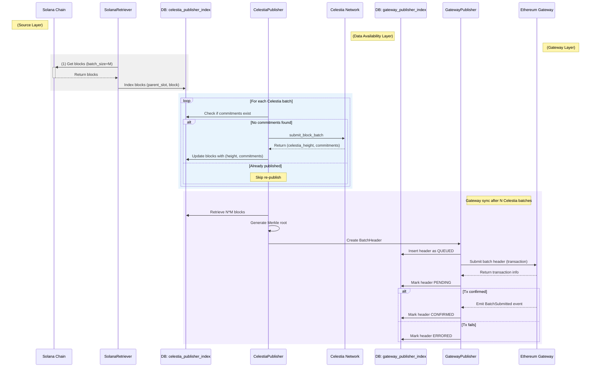
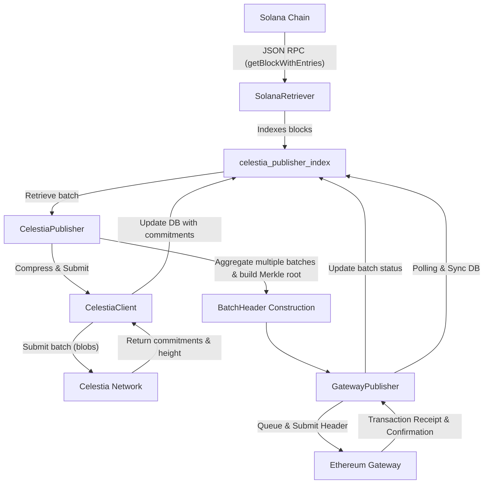
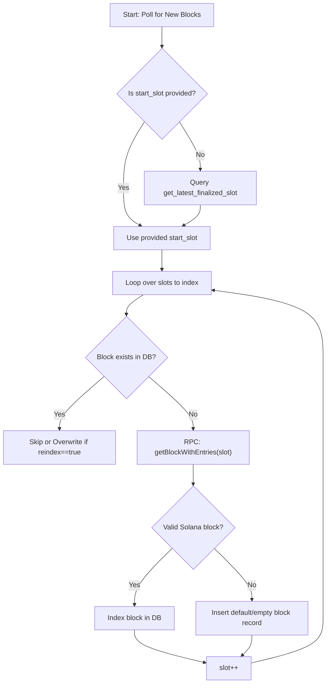
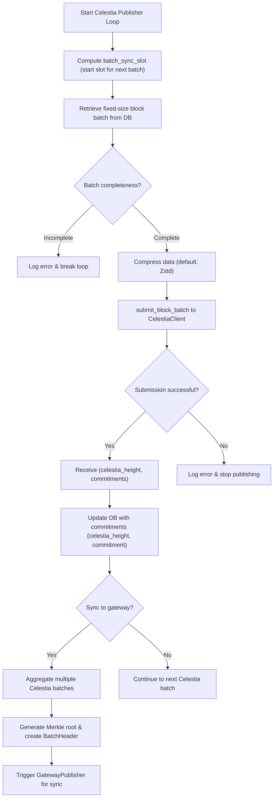
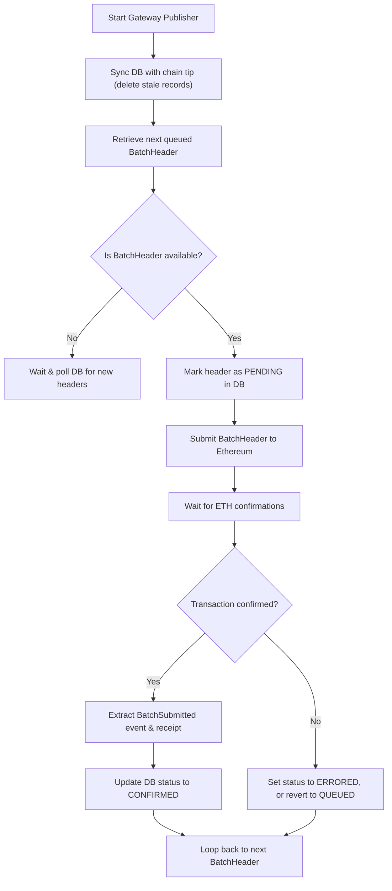

# Eclipse Celestia Publisher: Technical Documentation

## Table of Contents

1. [Introduction](#introduction)  
2. [Background: Celestia Data Availability](#background-celestia-data-availability)  
3. [System Overview](#system-overview)  
4. [Architecture and Components](#architecture-and-components)  
   - [Source Layer: Solana Retriever](#source-layer-solana-retriever)  
   - [Data Availability Layer: Celestia Publisher](#data-availability-layer-celestia-publisher)  
   - [Gateway Layer: Ethereum Publisher](#gateway-layer-ethereum-publisher)  
5. [Data Flow and Processing Pipeline](#data-flow-and-processing-pipeline)  
   - [Processing Phases](#processing-phases)  
6. [Detailed Sequence Diagrams](#detailed-sequence-diagrams)  
   - [Overall System Architecture](#overall-system-architecture)  
   - [SolanaRetriever Module](#solanaretriever-module)  
   - [CelestiaPublisher Module](#celestiapublisher-module)  
   - [GatewayPublisher Module](#gatewaypublisher-module)  
7. [Configuration and Environment Variables](#configuration-and-environment-variables)  
8. [Database Models and Schema](#database-models-and-schema)  
9. [Error Handling and Recovery](#error-handling-and-recovery)  
10. [Additional Modules](#additional-modules)  
    - [Compression Module](#compression-module)  
    - [Cache Module](#cache-module)  
11. [Usage Examples](#usage-examples)  
12. [Implementation Details and Code Snippets](#implementation-details-and-code-snippets)  


---

## 1. Introduction

The Eclipse Celestia Publisher is a multi-layered system that ingests Solana-compatible (Eclipse) blocks, publishes these blocks to Celestia (a novel data availability blockchain), and anchors the resulting commitments on Ethereum. It aims to provide:

- Scalable Data Availability: Offloading block data to Celestia’s specialized data availability layer.  
- Robust Cryptographic Guarantees: Leveraging Celestia’s erasure coding and data availability sampling, plus Ethereum anchoring for final settlement.  
- Efficient Indexing and Publishing: Batching Solana blocks for improved throughput and cost savings.  
- End-to-End Visibility: Detailed logs, metrics, and robust error handling to ensure operators know exactly which blocks are published and their status on Ethereum.

---

## 2. Background: Celestia Data Availability

Celestia uses erasure coding (e.g., Reed-Solomon) and namespaced Merkle trees to ensure that data is indeed available when validators sign a block. Light clients sample random shares to confirm availability. Key steps:

1. Rollup data is submitted as a blob to Celestia.  
2. Validators break it into shares, apply erasure coding, and compute a Merkle root.  
3. Light nodes randomly sample a few shares (rather than the entire data) to confirm availability with high probability.  
4. If data is withheld, sampling will likely detect it, enabling fraud proofs or fallback mechanisms.

*(For more info, see the [Celestia Docs on Data Availability](https://docs.celestia.org/learn/how-celestia-works/data-availability-layer) and prior “Celestia Data Availability Flow” references.)*

---

## 3. System Overview

The Eclipse Celestia Publisher system orchestrates:

1. Retrieving Solana (Eclipse) blocks  
2. Batching them for Celestia submission  
3. Publishing these batches as compressed blobs to the Celestia chain, receiving back a cryptographic commitment (e.g., Celestia block height plus a commitment hash)  
4. Aggregating multiple Celestia batches into a “gateway batch”  
5. Anchoring that gateway batch on Ethereum with a Merkle root that references all the blocks.

The system is intentionally separated into phases so that any partial failures can be retried without invalidating the entire pipeline.

---

## 4. Architecture and Components

### Source Layer: Solana Retriever
Module: `SolanaRetriever`  
Key Points:  
- Polls an Eclipse node (`eclipse_node_url`) for new blocks.  
- Writes each retrieved block into `celestia_publisher_index` with a unique `parent_slot`.  
- Handles empty slots by inserting default records.  
- Includes exponential backoff for RPC requests (`getBlockWithEntries`) and for retrieving the latest finalized slot.

### Data Availability Layer: Celestia Publisher
Module: `CelestiaPublisher`  
Key Points:  
- Retrieves blocks from `celestia_publisher_index` in fixed-size batches (default: `CELESTIA_PUBLISHER_BATCH_SIZE=50`).  
- Compresses block data (default: Zstd) into Celestia “blobs.”  
- Submits each batch to Celestia, obtains `(celestia_height, commitments)` which are stored back in `celestia_publisher_index`.  
- Uses exponential backoff for submissions.  
- Once enough Celestia batches are published (a threshold set by `gateway_batch_sync_period`), the publisher triggers Merkle tree generation across N * 50 blocks.

### Gateway Layer: Ethereum Publisher
Module: `GatewayPublisher`  
Key Points:  
- Takes the aggregated blocks from CelestiaPublisher, constructs a `BatchHeader` (which includes a Merkle root over all blocks).  
- Manages the Ethereum transaction lifecycle:
  - QUEUED → PENDING → CONFIRMED or ERRORED  
- Submits the batch header to an on-chain `Gateway` contract. If confirmation fails, sets status to `ERRORED` and can re-queue or require manual intervention.

---

## 5. Data Flow and Processing Pipeline

Below is a consolidated sequence diagram combining all phases:



The core pipeline:

1. Block Indexing (Source Layer): `SolanaRetriever` continuously fetches and indexes Solana blocks.  
2. Celestia Publishing (Data Availability Layer): `CelestiaPublisher` picks up batches, compresses them, and submits them to Celestia for data availability.  
3. Gateway Synchronization (Gateway Layer): After multiple Celestia batches, a Merkle root is created, and the system anchors that root on Ethereum.

---

### Processing Phases

1. Block Indexing Phase  
   - Retrieves blocks from Solana/Eclipse, indexes them with `parent_slot`, `block`, `celestia_height=null`, `commitment=null`.  
   - If reindex is specified, it can overwrite existing records, forcibly refreshing the blocks from scratch.

2. Celestia Publishing Phase  
   - Reads the local DB for the next *uncommitted* batch.  
   - Compresses and sends to Celestia; logs the returned `celestia_height` and `commitment` in `celestia_publisher_index`.  
   - If any submission fails, the system halts new publishing until issues are resolved.  
   - If the batch is already published (commitments exist), it proceeds to the next batch.

3. Gateway Synchronization Phase  
   - After N Celestia batches (N * 50 blocks) are confirmed, the publisher merges them, builds a Merkle tree, and forms a `BatchHeader`.  
   - `GatewayPublisher` then queues this batch header for Ethereum submission.  
   - On success (transaction confirmations), the batch is marked `CONFIRMED`; if it reverts or fails, it is marked `ERRORED`.

---

## 6. Detailed Sequence Diagrams

Below are four mermaid diagrams showing the overall system plus the three key modules. The textual explanation follows each diagram.

### Overall System Architecture



Explanation:

- SolanaRetriever writes raw blocks (with `parent_slot` and block data) into `celestia_publisher_index`.  
- CelestiaPublisher fetches uncommitted blocks, compresses them, and calls `CelestiaClient` to submit data to the Celestia network.  
- The returned commitments are stored back in the same table.  
- After multiple Celestia batches, the publisher constructs a Merkle root representing N * 50 blocks.  
- GatewayPublisher then takes that root, forms a `BatchHeader`, and submits it to Ethereum.  
- Once confirmed on Ethereum, the system updates the local DB accordingly.

---

### SolanaRetriever Module



Explanation:

- The retriever can start from either a user-specified slot or the latest finalized slot on Solana/Eclipse.  
- It loops until it reaches a configured end or indefinite.  
- For each slot, it attempts to fetch the block.  
- If a block is missing, it logs or writes an empty record (denoting no actual block data).  
- This ensures a continuous sequence of `parent_slot`s in `celestia_publisher_index`.

---

### CelestiaPublisher Module



Explanation:

- The publisher queries the DB for a batch of M blocks. If fewer than M are found (due to empty or missing blocks), it logs an error.  
- If compress + submit is successful, it updates each block with `(celestia_height, commitment)`.  
- At certain intervals (every `gateway_batch_sync_period` batches), it aggregates those blocks to produce a Merkle root, then signals the GatewayPublisher.

---

### GatewayPublisher Module



Explanation:

- The GatewayPublisher continuously looks for `QUEUED` batch headers in `gateway_publisher_index`.  
- When found, it updates them to `PENDING` and submits the transaction.  
- If the transaction fails, the publisher sets the record to `ERRORED` (and might attempt re-queuing).  
- If confirmed on Ethereum, it sets the record to `CONFIRMED` and processes the next batch.

---

## 7. Configuration and Environment Variables

All configuration can be loaded from a TOML file or overridden by environment variables. Key variables:

- `PUBLISHER_DB_PATH`: Path to local DB (SQLite).  
- `CELESTIA_NODE_URL`: URL of Celestia node.  
- `CELESTIA_NODE_AUTH_TOKEN`: Auth token for Celestia.  
- `ECLIPSE_NODE_URL`: URL of Solana/Eclipse node.  
- `CELESTIA_NAMESPACE`: Namespace ID for Celestia data blobs.  
- `CELESTIA_PUBLISHER_BATCH_SIZE`: Default 50 blocks per Celestia batch (some references mention 60, so confirm your code).  
- `ETH_URL` / `ETH_CHAIN_ID`: Ethereum provider details.  
- `GATEWAY_ADDRESS`: Address of deployed Ethereum Gateway contract.  
- `GATEWAY_APPENDER_SECRET_KEY`: Private key for Ethereum transactions.  
- `SERVER_PORT`: Port for the HTTP server (health checks, metrics).  

All have sensible defaults for local testing.

Sample `config.tml`:
```toml
[publisher]
db_path = "data/publisher_db"
celestia_node_url = "http://localhost:11111"
celestia_node_auth_token = "my-secret-token"
eclipse_node_url = "http://localhost:8899"
celestia_namespace = "11223344aabbccddeeff"
eth_url = "https://mainnet.infura.io/v3/myproject"
eth_chain_id = 1
gateway_address = "0xGatewayDeployedAddress"
gateway_appender_secret_key = "0xPrivateKeyHere"
server_port = 8080
```

---

## 8. Database Models and Schema

### `celestia_publisher_index`

Tracks each Solana block:

```sql
CREATE TABLE celestia_publisher_index (
    id              INTEGER     PRIMARY KEY AUTOINCREMENT,
    created_at      TIMESTAMP   DEFAULT CURRENT_TIMESTAMP NOT NULL,
    updated_at      TIMESTAMP   DEFAULT CURRENT_TIMESTAMP NOT NULL,
    parent_slot     INTEGER     NOT NULL,
    block           BLOB,
    celestia_height INTEGER,
    commitment      BLOB
);
```

- `parent_slot`: Unique slot ID from the Solana chain.  
- `block`: Serialized block data (or empty if no block).  
- `celestia_height`: The Celestia chain height at which the data was committed.  
- `commitment`: The cryptographic commitment from Celestia.

### `gateway_publisher_index`

Tracks larger batch headers for Ethereum:

```sql
CREATE TABLE gateway_publisher_index (
    id              INTEGER     PRIMARY KEY AUTOINCREMENT,
    created_at      TIMESTAMP   DEFAULT CURRENT_TIMESTAMP NOT NULL,
    updated_at      TIMESTAMP   DEFAULT CURRENT_TIMESTAMP NOT NULL,
    batch_header    JSONB       NOT NULL,
    batch_submitted JSONB,
    tx_status       TEXT        NOT NULL,
    tx_receipt      JSONB,
    tx_error        JSONB
);
```

- `batch_header`: JSON that includes `batch_root`, `l_2_start_slot`, `l_2_end_slot`, `da_namespace`, etc.  
- `tx_status`: State machine for the Ethereum transaction (QUEUED, PENDING, CONFIRMED, ERRORED).  
- `tx_receipt`: Ethereum transaction receipt if confirmed.  
- `batch_submitted`: Additional data from the `BatchSubmitted` event.

---

## 9. Error Handling and Recovery

- Exponential Backoff: Each RPC call (Solana/Eclipse, Celestia, Ethereum) uses `tokio_retry` with jitter.  
- Empty Slots: If the retriever cannot find a block at slot X, it records an empty row. The publisher logs a warning.  
- Partial Batches: If fewer than `M` blocks are found for a batch, the publisher logs an error and halts.  
- Celestia Submission Failures: If a batch fails, the system sets a global flag (`CELESTIA_PUBLISH_NEXT_BATCH`) to stop future publishing. Manual intervention is needed.  
- Ethereum Transaction Failures: The batch header is marked `ERRORED`. A retry or manual fix can be performed.

---

## 10. Additional Modules

### Compression Module

```rust
pub enum Compression {
    Id,
    Lzma { preset: u32 },
    Zstd { level: i32 },
    ...
}
```

- Default: Zstd with level 3.  
- Usage: `CelestiaPublisher` compresses blocks before `submit_block_batch`.

### Cache Module

```rust
pub struct Cache {
    pub db_pool: Pool<Sqlite>,
}
```

- Provides a shared SQLite pool with WAL mode, foreign keys, etc.  
- All modules use `cache.db_pool` to query/update the DB.

---

## 11. Usage Examples

### 1. Running the Solana Retriever

```bash
syzygy-celestia-publisher SolanaRetriever \
  --config-path config.toml \
  --start-slot 1000 \
  --batch-size 50 \
  --reindex=false
```

- start-slot: Start from a specific slot (otherwise it picks up the last known slot or the latest finalized slot).  
- batch-size: Number of slots to retrieve in one pass.  
- reindex: If true, it overwrites existing blocks.

### 2. Running the Celestia Publisher

```bash
syzygy-celestia-publisher CelestiaPublisher \
  --config-path config.toml \
  --reindex=false
```

- Continuously queries uncommitted blocks, compresses, and submits them to Celestia.

### 3. Running the Gateway Publisher

```bash
syzygy-celestia-publisher GatewayPublisher \
  --config-path config.toml
```

- Polls for queued batch headers in `gateway_publisher_index`.  
- Submits to the Ethereum Gateway contract; waits for confirmations.

---

## 12. Implementation Details and Code Snippets

Below are selected snippets illustrating key logic:

### Submitting a Batch to Celestia

```rust
// In CelestiaPublisher
let (celestia_height, commitments) = celestia_client
    .submit_block_batch(&block_batch)
    .await
    .expect("Failed to submit batch");

// Update DB
for (block, commitment) in block_batch.iter().zip(commitments) {
    self.index_commitment(block.parent_slot, celestia_height, commitment).await?;
}
```

### Gateway Publisher Tx Lifecycle

```rust
match self.gateway.submit_batch(batch_header.clone()).send().await {
    Ok(pending_tx) => {
        // Wait for confirmations
        match pending_tx.confirmations(ETHEREUM_PUBISHER_TX_CONFIRMATIONS).await {
            Ok(Some(receipt)) => {
                self.update_confirmed(&batch_header, &receipt).await?;
            }
            Ok(None) | Err(e) => {
                self.update_errored(&batch_header, e.to_string()).await?;
            }
        }
    }
    Err(e) => {
        self.update_errored(&batch_header, e.to_string()).await?;
    }
}
```
---
